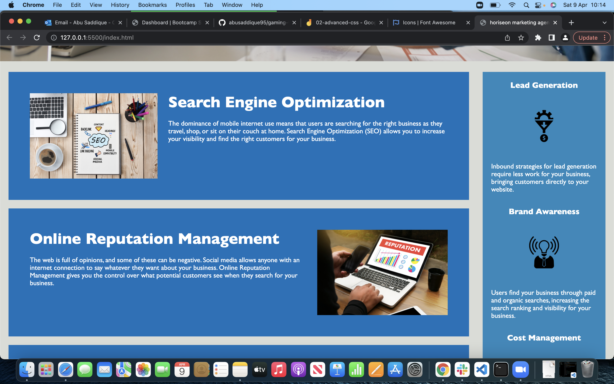
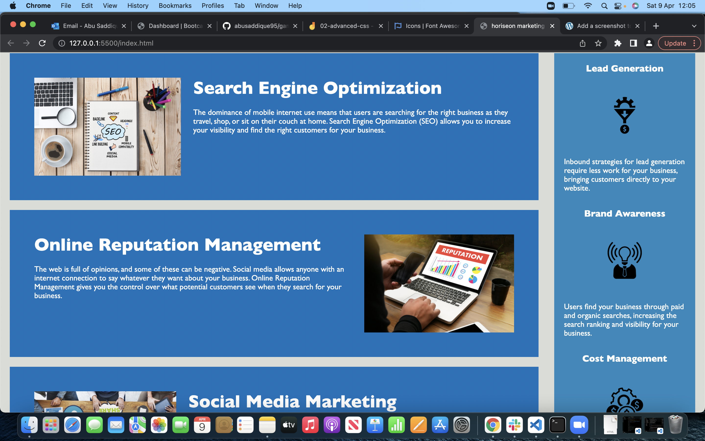

# marketing-agency-refactor

Use semantic HTML to refactor a marketing website.

## Deployed URL

https://abusaddique95.github.io/marketing-agency-refactor/

## Technologies

- HTML
- CSS
- GitHub
- Git

## HTML

replaced the divs with semantic elements such as nav, main and sections

## CSS

removed duplicates and grouped together the class names to make the code cleaner.

## Before Screenshots

## After Screenshots

## About Me

One of the first projects i have created on my programming journey.
